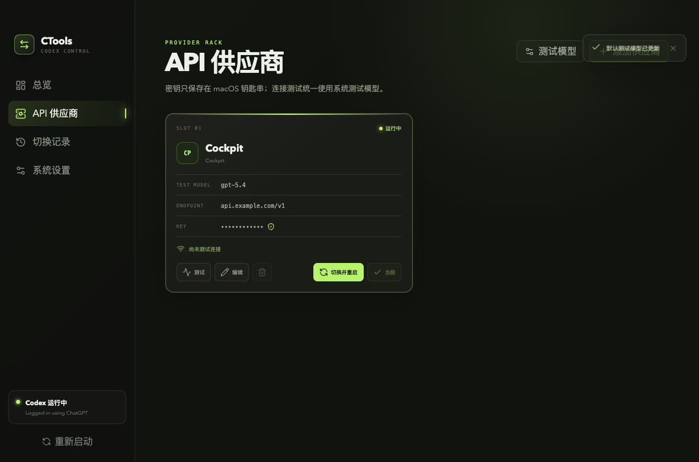

# CTools

[](https://github.com/359587/ctools/actions/workflows/ci.yml)
[](LICENSE)

CTools is a macOS utility for safely switching Codex between ChatGPT login mode and custom providers that implement the OpenAI Responses API.

[中文](README.md) · [Architecture](docs/ARCHITECTURE.md) · [Contributing](CONTRIBUTING.md) · [Security](SECURITY.md)



> The v0.1.1 GitHub Release is source-only. CTools is not Apple-notarized yet; macOS may report a self-built or trusted test build as “damaged” and offer to move it to the Trash. See the installation notes below.

## Why CTools

Editing `~/.codex/config.toml` by hand can introduce typos, leak credentials, or leave Codex unusable. CTools treats a switch as a reversible transaction: it verifies the provider, creates an encrypted snapshot, writes the configuration atomically, and runs Codex diagnostics. Any failed step restores the original configuration.

## Features

- Presets for Cockpit, Sub2API, AIClient2API, and 9Routor, plus custom providers.
- API keys live in macOS Keychain and are excluded from state, logs, and backups.
- Preflight checks call `/responses`, not only `/models`.
- Atomic configuration writes followed by `codex --strict-config doctor --json`.
- Automatic rollback on failure and startup recovery for interrupted operations.
- Recovery from the dashboard, history, native menu, or `Shift + Command + R`.
- An independent test model for each provider, enriched with models discovered from that provider.

## Installation

### Option 1: Run from source

Requirements:

- macOS
- Node.js 22 or later
- pnpm 10
- Xcode Command Line Tools (`xcrun swiftc` is used for the native helper)
- Codex Desktop or an executable Codex CLI

```bash
git clone --branch main --single-branch https://github.com/359587/ctools.git
cd ctools
pnpm install --frozen-lockfile
pnpm start
```

CTools reads `$CODEX_HOME/config.toml`, falling back to `~/.codex/config.toml`. Always use an isolated `CODEX_HOME` for development and tests. Never add a real configuration or credential to a fixture.

### Option 2: Build and install the macOS app

After installing the dependencies above, run:

```bash
pnpm make
```

Open `out/make/CTools.dmg`, drag `CTools.app` into Applications, and launch `/Applications/CTools.app`.

#### macOS says the app is “damaged” or should be moved to the Trash

Gatekeeper can show this message because the current build is not notarized with an Apple Developer ID. Continue only if the app came from this repository or you built it yourself from this repository:

```bash
codesign --verify --deep --strict --verbose=2 "/Applications/CTools.app"
sudo xattr -rd com.apple.quarantine "/Applications/CTools.app"
open "/Applications/CTools.app"
```

The first command must succeed. If signature verification fails, delete the app and download or build it again. Do not re-sign it with `codesign --force --deep --sign -`, because changing the app identity can affect Keychain access. `xattr` only removes the macOS download quarantine attribute; it does not repair a damaged file or an invalid signature.

If macOS only says that the developer cannot be verified, Control-click `CTools.app` in Finder and select Open, or allow it under System Settings → Privacy & Security.

## Usage

1. Install Codex Desktop, complete ChatGPT sign-in at least once, and make sure Codex is in login mode before launching CTools. On first launch, CTools reads the current configuration and captures a recovery baseline.
2. Open API Providers, select Add Provider, choose a preset or custom provider, and enter its display name, Base URL, test model, and API key. A model is prefilled for the provider type; you can also choose a model returned by the provider or enter a custom model ID. 9Routor models automatically use the `cx/` prefix.
3. Run Test Connection first. After it succeeds, select Save Only or Save and Switch. Codex exits and restarts automatically during a switch.
4. To return to ChatGPT login mode, select Switch Back to Login Mode on the dashboard.
5. If a provider or configuration fails, restore the pre-switch configuration from One-click Restore, Switch History, the application menu, or `Shift + Command + R`.

API keys stay in macOS Keychain. Do not force-quit CTools during a switch. If an operation is interrupted, the next launch attempts to recover the unfinished transaction.

## Validate and build

```bash
pnpm check
pnpm audit:deps
pnpm test:security
pnpm package
pnpm make
```

Build outputs are written to `out/`. The default build is ad-hoc signed for local validation. Distribution to other users should use a Developer ID, Apple notarization, and a trusted release process.

## Data and privacy

| Data | Location | Notes |
| --- | --- | --- |
| Codex configuration | `$CODEX_HOME/config.toml` | CTools scopes changes to its managed provider block and root model fields |
| CTools state and snapshots | `~/Library/Application Support/CTools/` | Configuration snapshots use AES-256-GCM |
| API keys | macOS Keychain service `com.ray.ctools.provider` | Excluded from state, logs, and backups |
| Snapshot master key | macOS Keychain service `com.ray.ctools.backup` | Used only for local snapshot encryption |

CTools does not call `codex logout` and does not modify or back up `auth.json`. Provider tests connect directly from your Mac to the configured `/models` and `/responses` endpoints; this project does not operate a proxy. Deleting a provider keeps its historical Keychain entry so older recovery points remain usable.

## Contributing

Remove API keys, tokens, real provider URLs, `auth.json` contents, and personal paths before opening an issue. See [CONTRIBUTING.md](CONTRIBUTING.md) for development rules. Report vulnerabilities privately according to [SECURITY.md](SECURITY.md).

## License and disclaimer

Licensed under the [MIT License](LICENSE).

CTools is an independent community project and is not affiliated with, authorized by, or endorsed by OpenAI. OpenAI, ChatGPT, and Codex are trademarks of their respective owners. Compatibility, security, pricing, and terms for third-party APIs remain the responsibility of their providers.
