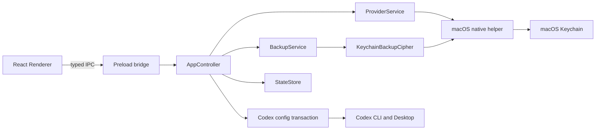

# CTools Architecture

CTools 是一个 Electron 应用。Renderer 只负责展示和收集输入，所有配置、凭据、进程和文件操作都在 Main 进程完成。

## Main components

| Component | Responsibility |
| --- | --- |
| `AppController` | 串行化操作、维护事务 journal、切换、恢复和历史记录 |
| `ProviderService` | 校验供应商输入，从钥匙串取 Key，并测试 `/models` 与 `/responses` |
| `codex-config.ts` | 解析 TOML，只写根级模型字段和 CTools 管理块 |
| `BackupService` | 创建、校验和恢复配置快照 |
| `KeychainBackupCipher` | 使用钥匙串主密钥执行 AES-256-GCM 加解密 |
| `CodexService` | 定位 Codex CLI，读取登录状态，严格诊断并控制桌面端 |
| Swift native helper | Keychain 读写，以及 Codex Desktop 状态、退出和启动 |

## Switch transaction

API 切换的关键顺序如下：

1. 使用目标供应商和系统测试模型调用 `/responses`。
2. 停止 Codex Desktop。
3. 加密备份当前配置，并核对备份前后的 SHA-256，防止并发覆盖。
4. 写入 journal 的 `prepared` 状态。
5. 生成配置并通过临时文件原子替换 `config.toml`。
6. 更新 journal 为 `config-written`，核对模式并运行严格诊断。
7. 更新 journal 为 `validated`，启动 Codex 并再次核对模式。
8. 清除 journal，记录历史并清理过期快照。

发生异常时，控制器恢复本次操作前的快照、清除 journal，并尽力重新启动 Codex。应用启动时如果发现 journal，优先恢复 journal 指向的快照。

## Configuration ownership

CTools 使用带边界注释的单一 managed block，并使用固定 provider ID。它会保留其他 TOML 区域和未知字段；如果用户已经创建了同名 provider 且不带 CTools 边界标记，切换会停止而不是覆盖。

切回登录模式时，CTools 恢复首次启动时捕获的根级 `model` 和 `model_provider` 状态，不调用 `codex logout`，也不访问 `auth.json`。

## Recovery selection

“一键还原”优先选择最新的登录模式快照；没有登录快照时，回退到最后一个已知良好快照。历史页面的显式恢复则使用用户选中的快照，并在恢复前再创建一份安全快照。

## Stored data

- 状态文件包含供应商名称、Base URL、Keychain 记录 ID、切换历史和快照元数据。
- 状态文件不包含 API Key。
- `.ctbackup` 文件包含加密的 Codex 配置内容和认证标签。
- API Key 与快照主密钥使用不同的 macOS Keychain service。

## Testing boundary

单元测试应使用 `tests/fixtures/codex-home`、临时状态目录和内存替身。任何需要启动应用的自动化验证都应设置隔离的 `CODEX_HOME` 与 `CTOOLS_USER_DATA`，不得访问开发者真实配置。
